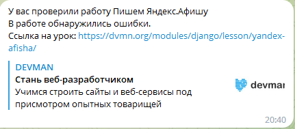

# devman бот для уведомлений о проверке работ

Скрипт шлет уведомления о результатах проверки работ с сайта [Devman](https://dvmn.org/)

## Как запустить

### Настройка параметров бота

Создайте файл `.env` со следующими переменными:
* DWMN_TOKEN=[Devman](https://dvmn.org/api/docs/) API token
* TOKEN_TELEGRAM=telegram bot token
* CHAT_ID_TG=ваш telegram chat id

Для получения TOKEN_TELEGRAM создайте своего бота: [Bot Father](https://telegram.me/BotFather)

Для получения CHAT_ID_TG воспользуйтесь ботом: [userinfobot](https://t.me/userinfobot)


## Как установить

### Установка библиотек и зависимостей

Развернуть виртуальное окружение интерпретатора
```sh
python3 -m venv  
```

Активируйте виртуальное окружение

```sh
source pythonenv/bin/activate 
```

Безопасно обновите pip

```sh
pip install --upgrade pip      
```

Установить требуемые библиотеки для скрипта командой
```sh
pip install -r requirements.txt
```

Для запуска выполните команду в консоли:

```commandline
python bot.py
```

## Результат выполнения

После проверки вашей работы, Вам придет уведомление:

